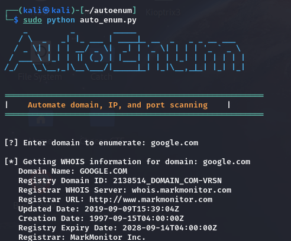

# AutoEnum - Enumeration Tool

- AutoEnum is a powerful and automated enumeration tool designed to facilitate domain, IP, and port scanning.
- AutoEnum leverages popular tools like Nmap and Sublist3r to gather essential information about targets.



## Features

- **WHOIS Lookup**: Fetches WHOIS information for a given domain.
- **DNS Lookup**: Resolves domain names to their respective IP addresses.
- **Nmap Integration**: Supports multiple scanning options including:
  - Aggressive scanning
  - Top ports scanning
  - Service detection
  - OS detection
- **Subdomain Enumeration**: Uses Sublist3r to discover subdomains.
- **Vulnerability Checking**: Placeholder for checking known vulnerabilities (requires integration).

## Requirements

Before you begin, ensure you have the following installed:

- Python 3.x
- pip (Python package installer)

### Dependencies

Install the required Python packages using the following command:

```bash
pip install -r requirements.txt
```

Clone the repository:

```bash
git clone https://github.com/yourusername/autoenum.git
cd autoenum
```
Install the required dependencies:

```bash
pip install -r requirements.txt
```

Ensure you have Sublist3r installed globally. If not, follow the Sublist3r installation instructions.

## Usage
Run the tool with the following command:

```bash
sudo python auto_enum.py
```

## Video
## Video

[Download and Watch the Demo Video](Assets/Recording_orig.mp4)

